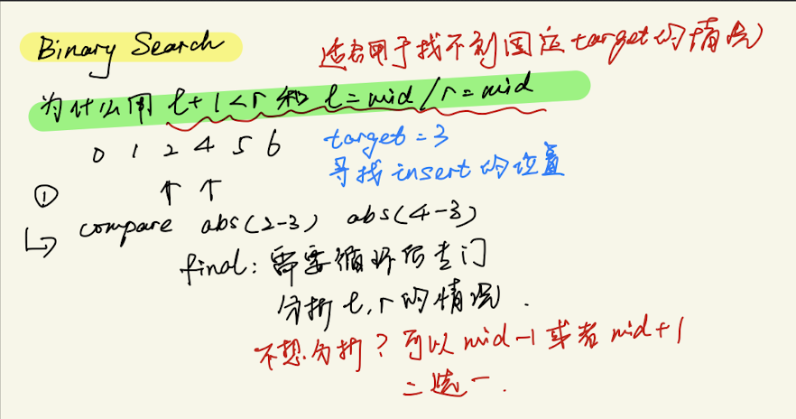
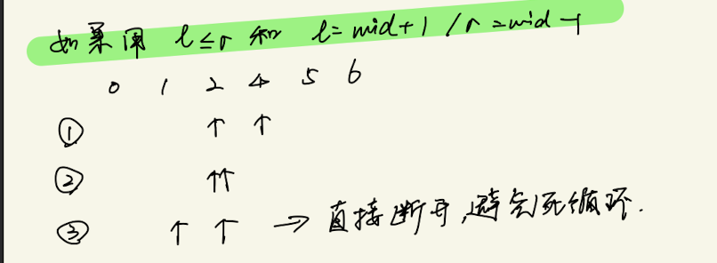
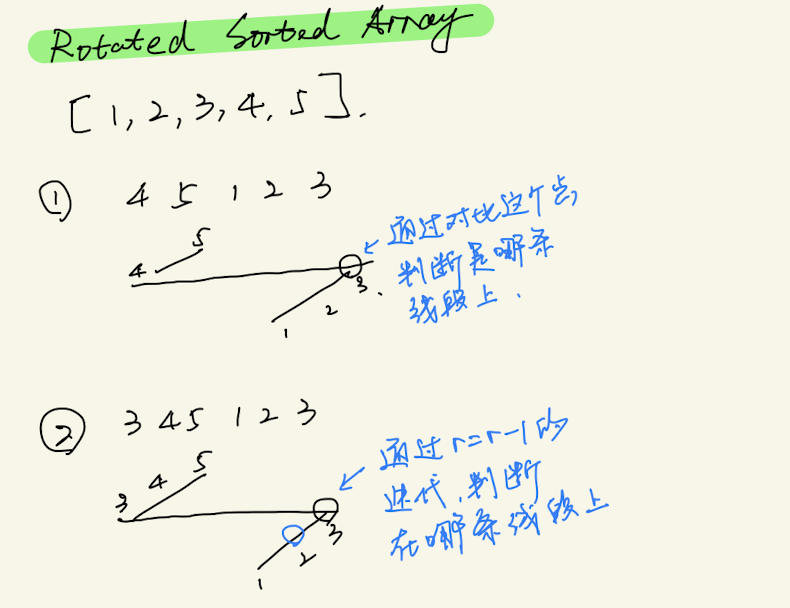
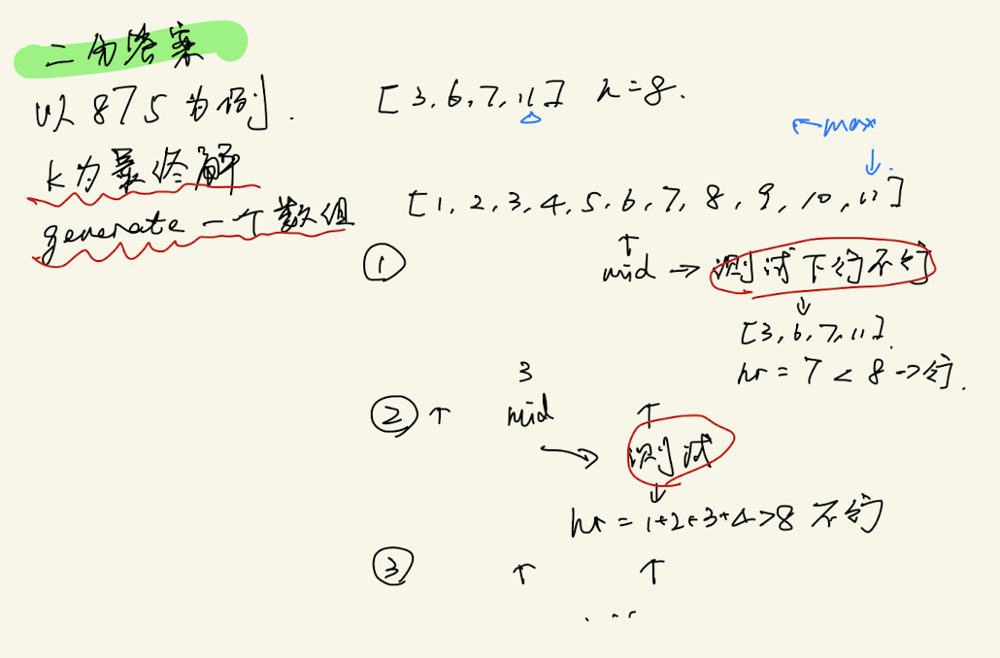

# Binary Search总结

## 总结

- 什么时候可以用到binary search？
  - 在有排序的数列上找东西就可以用binary search
  - 如果要求O(logn)的算法可以考虑binary search
- 解题注意点
  - 要注意left right两个指针如何移动
    - 如果target == mid， 指针移动因题而异
    - 是否需要+1 -1的移动
  - 注意corner case
    - if len(array) == 0
    - l和r在list最左最右点
- 解题习惯与技巧
  - 如果target不一定存在，用while l + 1 < r 能够避免歧义，如果存在，可以使用l <= r. 但l和r移动是只能l=mid或者r=mid





## 题型分类

### 传统二分 —— 找目标数的index

1. 注意边界条件
2. 循环条件：
   - 如果是找target：l <= r
   - 如果是找最前的最后的： l + 1 <=r，l = mid/ r = mid 但是出了循环后要check一下外部的l和r，如果不想循环完还要check 1 < r 但是 mid - 1 或者 + 1 只能二选一

- [Binary Search](#binary-search)
- [Find First and Last Position of Element in Sorted Array](#find-first-and-last-position-of-element-in-sorted-array)
- [Search a 2D Matrix](#search-a-2d-matrix)
- [First Bad Version](#first-bad-version)
- [Search Insert Position](#search-insert-position)
- [Sqrt(x)](#sqrtx)
- [Valid Perfect Square](#valid-perfect-square)
  
### 基于Rotated sorted array 寻找目标数的index

通过比对最右最左的值，同时把它设成target值。查看当前mid所在的位置在哪一段线段上。最后输出的时候记得比对r 和 l。如果有重复的值的话，可以r=r-1缩小范围



- [Search in Rotated Sorted Array](#search-in-rotated-sorted-array)
- [Search in Rotated sorted Array II](#search-in-rotated-sorted-array-ii)
- [Find Minimum in Rotated Sorted Array](#find-minimum-in-rotated-sorted-array)
- [Find Minimum in Rotated Sorted Array II](#find-minimum-in-rotated-sorted-array-ii)
- [Peak Index in a Mountain Array](#peak-index-in-a-mountain-array)
- [Find in Mountain Array](#find-in-mountain-array)

### 形式有点变形

建立一个list，其中的元素都是答案

- [Missing Element in Sorted Array](#missing-element-in-sorted-array)
- [Time Based Key-Value Store](#time-based-key-value-store)
- [Median of Two Sorted Arrays](#median-of-two-sorted-arrays)
- [Single Element in a Sorted Array](#single-element-in-a-sorted-array)  

### 二分答案

- 如果题目要求寻找最大最小的可能性，有可能就是需要运用这个方法
- 通过题目，自己要generate一个数组，通过调整mid并且不断测试查看是否当前的mid符合条件
  


- [Kth Smallest Element in a Sorted Matrix](#kth-smallest-element-in-a-sorted-matrix)
- [Capacity to ship packages within d days](#capacity-to-ship-packages-within-d-days)
- [koko eating bananas](#koko-eating-bananas)
- [Split Array Largest Sum](#split-array-largest-sum)
- [Divide Chocolate](#divide-chocolate)
- [Minimize Max Distance to Gas Station](#minimize-max-distance-to-gas-station)
- [Sum of Mutated Array Closest to Target](#sum-of-mutated-array-closest-to-target)
- [Minimum Number of Days to Make m Bouquets](#minimum-number-of-days-to-make-m-bouquets)

- ### 特殊
  
- [Longest Increasing Subsequence](#longest-increasing-subsequence)

### 易错

- rotated sorted array 类型
- find peak

--------

### [Binary Search](https://leetcode.com/problems/binary-search/)

超经典

```python
class Solution(object):
    def search(self, nums, target):
        """
        :type nums: List[int]
        :type target: int
        :rtype: int
        """
        left, right = 0, len(nums) - 1
        
        while left <= right:
            mid = (left + right) // 2
            if nums[mid] < target:
                left = mid + 1
            elif nums[mid] > target:
                right = mid - 1
            else:
                return mid
        
        return -1
```

### [Find First and Last Position of Element in Sorted Array](https://leetcode.com/problems/find-first-and-last-position-of-element-in-sorted-array/)

注意mid target 相等的时候如何判断

```python
class Solution(object):
    def searchRange(self, nums, target):
        """
        :type nums: List[int]
        :type target: int
        :rtype: List[int]
        """
        
        if len(nums) <= 0: 
            return [-1,-1]
        
        left, right = 0, len(nums) - 1
# get first        
        while left + 1 < right:
            mid = (left + right) // 2
            if nums[mid] < target:
                left = mid
            elif nums[mid] >= target:
                right = mid
            
        if nums[left] == target:
            min_t = left
        elif nums[right] == target:
            min_t = right
        else:
            min_t = -1
# get last 
        left, right = 0, len(nums) - 1
        while left + 1 < right:
            mid = (left + right) // 2
            if nums[mid] <= target:
                left = mid
            elif nums[mid] > target:
                right = mid
            
        if nums[right] == target:
            max_t = right
        elif nums[left] == target:
            max_t = left
        else:
            max_t = -1        
        return [min_t,max_t]
```

### [Search a 2D Matrix](https://leetcode.com/problems/search-a-2d-matrix/)

- 考虑如何把2d坐标转化成1d
- 如果可以的话尽量按照binary search， left 《= right 并且每次left right = mid + 1 或者 -1

```python
class Solution(object):
    def searchMatrix(self, matrix, target):
        """
        :type matrix: List[List[int]]
        :type target: int
        :rtype: bool
        """
        nrow = len(matrix)
                
        if nrow == 0:
            return False
        
        ncol = len(matrix[0])
            
        left, right = 0, ncol * nrow - 1
        
        while left <= right:
            mid = (left + right) // 2
            mid_row = mid // ncol
            mid_col = mid % ncol
        
            if matrix[mid_row][mid_col] < target:
                left = mid + 1
            elif matrix[mid_row][mid_col] > target:
                right = mid - 1
            else:
                return True
            
        return False
```

### [Search a 2D Matrix II](https://leetcode.com/problems/search-a-2d-matrix-ii/)

不是binary search的题

解法：找到右上角的数字，有比较明显的性质：向下变大，向左变小。作为控制

O(m+n)

```python
class Solution(object):
    def searchMatrix(self, matrix, target):
        """
        :type matrix: List[List[int]]
        :type target: int
        :rtype: bool
        """
        
        
        if len(matrix) == 0 :
            return False
        
        col = len(matrix[0]) - 1
        row = 0
        
        while row < len(matrix) and col >= 0:
            if matrix[row][col] < target:
                row = row + 1
            elif matrix[row][col] > target:
                col = col - 1
            else:
                return True
        return False
```

### [Search Insert Position](https://leetcode.com/problems/search-insert-position/)

```python
class Solution(object):
    def searchInsert(self, nums, target):
        """
        :type nums: List[int]
        :type target: int
        :rtype: int
        """
        l, r = 0, len(nums) - 1
        while l + 1 < r:
            mid = (l + r) // 2
            if nums[mid] == target: return mid
            elif nums[mid] < target: l = mid
            else: r = mid        
        if nums[l] >= target: return l
        elif nums[r] < target: return r + 1
        else: return r
        
```

### Last Position of Target

```python
class solution(object):
    def search(self, nums, target):
        left, right = 0, len(nums) - 1
        
        while left + 1 < right:
            mid = (left + right) / 2
            if nums[mid] < target:
                left = mid
            elif nums[mid] > target:
                right = mid
            else:
                left = mid
                return mid
        
        return -1
```

### [First Bad Version](https://leetcode.com/problems/first-bad-version/)

```python
class solution(object):
    def findFirstBadVersion(self,n):
        left, right = 0, n
        if n == 0:
            return -1
        while left + 1 < right:
            mid = (left + right) // 2
            if isBadVersion(mid):
                right = mid
            else:
                left = mid
                
        if isBadVersion(left):
            return left
        return right
              
```

### [Find K Closest Elements](https://leetcode.com/problems/find-k-closest-elements/)

注意边界的溢出

```python
class Solution(object):
    def findClosestElements(self, arr, k, x):
        if len(arr) == 0 or k > len(arr):
            return []
        left, right = 0, len(arr) - 1
        while left + 1 < right:
            mid = (left + right) // 2
            if arr[mid] < x:
                left = mid
            elif arr[mid] > x:
                right = mid
            else:
                left = mid - 1
                right = mid
        res = []
        for i in range(k):
            if left < 0:
                res.append(arr[right])
                right += 1    
            elif right > len(arr) - 1:
                res.append(arr[left])
                left -= 1
            elif x - arr[left] <= arr[right] - x:
                res.append(arr[left])
                left -= 1
            else:
                res.append(arr[right])
                right += 1
        return sorted(res)
```

### Search in a big sorted array

```python
class solution(object):
    def find(target):
        left, right = 0,1
        while target > arraynum(right):
            left = right
            right *= 2 
        
        while left + 1 < right:
            mid = (left + right) / 2
            if arraynum(mid) < target:
                left = mid
            elif arraynum(mid) > target:
                right = mid
            else:
                left = mid
                
        if arraynum(left) == mid:
            return left
        elif arraynum(right) == mid:
            return right
        else:
            return -1
```

### [Search in Rotated Sorted Array](https://leetcode.com/problems/search-in-rotated-sorted-array/)

- 想象一幅图
- 对比left 和 mid之间的关系，观察left 和mid 是不是在一条直线上

```python
class Solution:
    def search(self, nums, target):
        if len(nums) == 0: return -1
        left, right = 0, len(nums) - 1
        while left <= right:
            mid = (left + right) // 2
            if nums[mid] == target:
                return mid
            elif nums[left] <= nums[mid]:
                if nums[left] <= target <= nums[mid]:
                    right = mid - 1
                else: 
                    left = mid + 1
            else:
                if nums[mid] <= target <= nums[right]:
                    left = mid + 1
                else:
                    right = mid - 1

        return -1    
```

### [Find Minimum in Rotated Sorted Array](https://leetcode.com/problems/find-minimum-in-rotated-sorted-array/)

- 可以想象一幅图
- 作为oooxxx类型的图，要找到o和x不同的性质是什么
- 要想到特殊情况，全部rotate了

```python
class Solution(object):
    def findMin(self, nums):
        """
        :type nums: List[int]
        :rtype: int
        """
        if len(nums) == 0:
            return -1      
        
        left, right = 0, len(nums) - 1
        target = nums[-1]
        
        while left + 1 < right:
            mid = (left + right) // 2
            if nums[mid] <= target:
                right = mid
            elif nums[mid] >= target:
                left = mid
        
        if nums[left] <= target:
            return nums[left]
        elif nums[right] <= target:
            return nums[right]
```

### [Find Minimum in Rotated Sorted Array II](https://leetcode.com/problems/find-minimum-in-rotated-sorted-array-ii/)

特殊情况：【3 1 3】

可以多一个判断，如果mid和right相等，把right往左移

不可以用left做判断，在不rotate的情况下不成立

```python
class Solution(object):
    def findMin(self, nums):
        """
        :type nums: List[int]
        :rtype: int
        """
        if len(nums) == 0:
            return -1
        
        left, right = 0, len(nums) - 1
        
        while left + 1 < right:
            mid = (left + right) // 2
            if nums[mid] < nums[right]:
                right = mid
            elif nums[mid] > nums[right]:
                left = mid
            else:
                right = right - 1
            
        if nums[left] <= nums[right]:
            return nums[left]
        else:
            return nums[right]
```

### [Peak Index in a Mountain Array](https://leetcode.com/problems/peak-index-in-a-mountain-array/)

```python
class Solution:
    def peakIndexInMountainArray(self, arr):
        l, r = 0, len(arr) - 1
        while l + 1 < r:
            mid = (l + r) // 2
            if arr[mid] < arr[mid+1]: l = mid
            else: r = mid
        return r   
```

### [Find in Mountain Array](https://leetcode.com/problems/find-in-mountain-array/)

```python
class Solution(object):
    def findInMountainArray(self, target, mountain_arr):
        """
        :type target: integer
        :type mountain_arr: MountainArray
        :rtype: integer
        """
        n = mountain_arr.length()
        l, r = 0, n - 1
#         find peak
        while l + 1 < r:
            mid = (l + r) // 2
            if mountain_arr.get(mid) < mountain_arr.get(mid+1):
                l = mid
            else: r = mid
        if mountain_arr.get(l) < mountain_arr.get(r):
            peak = mid
#         up direction find target
        l, r = 0, peak
        while l <= r:
            mid = (l + r) // 2
            cur = mountain_arr.get(mid)
            if cur == target: return mid
            elif cur < target: l = mid + 1
            else: r = mid - 1
#         down direction find targget
        l, r = peak, n - 1
        while l <= r:
            mid = (l + r) // 2
            cur = mountain_arr.get(mid)
            if cur == target: return mid
            elif cur < target: r = mid - 1 
            else: l = mid + 1
        return -1
```

### [Search in Rotated sorted Array][https://leetcode.com/problemset/algorithms/?status=Solved]

- 考虑mid是落在红线还是绿线

```python
class solution(object):
    def searchinRotated(self,nums, target):
        if len(nums) == 0:
            return -1
        
        left, right = 0,len(nums) - 1
        
        while left + 1 < right:
            mid = (left + right) // 2
            if nums[mid] == target:
                return mid
            elif nums[mid] > nums[left]:
                if nums[left] <= target and target < nums[mid]:
                    right = mid
                else:
                    left = mid
            else:
                if nums[mid] <= target and target < nums[right]:
                    left = mid
                else:
                    right = mid
        
        if nums[left] == target:
            return left
        elif nums[right] == target:
            return right
        else:
            return -1
```

### [Search in Rotated sorted Array II](https://leetcode.com/problems/search-in-rotated-sorted-array-ii/submissions/)

- 先判断是否等于

```python
class Solution(object):
    def search(self, nums, target):
        """
        :type nums: List[int]
        :type target: int
        :rtype: bool
        """
        
        if len(nums) == 0:
            return False
    
        left, right = 0, len(nums) - 1
        
        while left + 1 < right:
            mid = (left + right) // 2            
            if nums[mid] == target:
                return True          
            if nums[left] < nums[mid] :
                if nums[left] <= target and target < nums[mid]:
                    right = mid - 1
                else:
                    left = mid + 1 
            elif nums[left] > nums[mid]:
                if nums[mid] < target and target <= nums[right]:
                    left = mid + 1
                else:
                    right = mid - 1                    
            else:
                left = left + 1      
        if nums[left] == target or nums[right] == target:
            return True
        return False
```

### [Missing Element in Sorted Array](https://leetcode.com/problems/missing-element-in-sorted-array/)

```python
class Solution(object):
    def missingElement(self, nums, k):
        """
        :type nums: List[int]
        :type k: int
        :rtype: int
        """
        left, right = 0, len(nums) - 1
        while left + 1 < right:
            mid = (left + right) // 2
            remain = (nums[mid] - nums[0]) - (mid)
            if remain < k:
                left  = mid
            elif remain > k:
                right = mid
            else:
                while nums[mid - 1] + 1 == nums[mid]:
                    mid -= 1
                return nums[mid] - 1
        remain =  (nums[left] - nums[0]) - left
        res = nums[left] + k - remain
        if nums[right] < res: res += 1
        return res
```

### [Time Based Key-Value Store](https://leetcode.com/problems/time-based-key-value-store/)

```python
class TimeMap(object):

    def __init__(self):
        """
        Initialize your data structure here.
        """
        from collections import defaultdict
        self.map = defaultdict(list)
        

    def set(self, key, value, timestamp):
        """
        :type key: str
        :type value: str
        :type timestamp: int
        :rtype: None
        """
        self.map[key].append([value, timestamp])

    def get(self, key, timestamp):
        """
        :type key: str
        :type timestamp: int
        :rtype: str
        """
        ls = self.map[key]
        left, right = 0, len(ls) - 1
        while left + 1 < right:
            mid = (left + right) // 2
            if ls[mid][1] <= timestamp:
                left = mid
            elif ls[mid][1] > timestamp:
                right = mid
        if ls[right][1] <= timestamp: return ls[right][0]
        elif ls[left][1] <= timestamp: return ls[left][0]
        else: return ''
```

### [Median of Two Sorted Arrays](https://leetcode.com/problems/median-of-two-sorted-arrays/)

```python
class Solution(object):
    def findMedianSortedArrays(self, nums1, nums2):
        """
        :type nums1: List[int]
        :type nums2: List[int]
        :rtype: float
        """
        n1, n2 = len(nums1), len(nums2)
        if n1 > n2: return self.findMedianSortedArrays(nums2, nums1)
        k = (n1 + n2 + 1) / 2
        l, r = 0, n1
        while l < r:
            m1  = l + (r - l) / 2
            m2 = k - m1
            if nums1[m1] < nums2[m2 - 1]: l = m1 + 1
            else: r = m1
        
        m1, m2 = l, k - l
        c1 = max(-float('inf') if m1 <= 0 else nums1[m1-1], -float('inf') if m2 <= 0 else nums2[m2-1])
        if (n1 + n2) % 2 == 1: return c1
        c2 = min(float('inf') if m1 >= n1 else nums1[m1], float('inf') if m2 >= n2 else nums2[m2])
        return (c1 + c2) * 0.5
```

### [Find the Smallest Divisor Given a Threshold](https://leetcode.com/problems/find-the-smallest-divisor-given-a-threshold/)

```python
class Solution(object):
    def smallestDivisor(self, nums, threshold):
        """
        :type nums: List[int]
        :type threshold: int
        :rtype: int
        """
        l, r = 1, max(nums)
        while l + 1 < r:
            mid = (l + r) / 2
            if sum([(i+mid-1)/mid for i in nums]) > threshold:
                l = mid
            else:
                r = mid
        return l if sum([(i+l-1)/l for i in nums]) <= threshold else r
        
```

### [Kth Smallest Element in a Sorted Matrix](https://leetcode.com/problems/kth-smallest-element-in-a-sorted-matrix/)

```python
class Solution(object):
    def kthSmallest(self, matrix, k):
        """
        :type matrix: List[List[int]]
        :type k: int
        :rtype: int
        """
        n = len(matrix)
        low, high = matrix[0][0], matrix[n-1][n-1] + 1
        while low < high:
            mid = (low + high) // 2
            j = n - 1
            count = 0
            for i in range(n):
                while j>=0 and matrix[i][j] > mid: j -= 1
                count += j + 1
            if count < k: low = mid + 1
            else: high = mid
        return low
```

### [Single Element in a Sorted Array](https://leetcode.com/problems/single-element-in-a-sorted-array/)

指针移动的条件是，观察邻居点是不是和当前点是相同的，有奇偶的差别。

```python
class Solution(object):
    def singleNonDuplicate(self, nums):
        """
        :type nums: List[int]
        :rtype: int
        """
        l, r = 0, len(nums) - 1
        while l + 1 < r:
            mid = (l + r) // 2
            if mid % 2 == 0 and nums[mid + 1] == nums[mid]:
                l = mid
            elif mid % 2 == 1 and nums[mid - 1] == nums[mid]:
                l = mid
            else: r = mid
        if nums[l] == nums[l-1] or nums[l] == nums[l + 1]: return nums[r]
        else: return nums[l]
        
```

### [Capacity To Ship Packages Within D Days](https://leetcode.com/problems/capacity-to-ship-packages-within-d-days/)

```python
class Solution(object):
    def shipWithinDays(self, weights, D):
        """
        :type weights: List[int]
        :type D: int
        :rtype: int
        """
        l, r = max(weights), sum(weights)
        while l < r:
            mid = (l + r) // 2
            need, cur = 1, 0
            for w in weights:
                if cur + w > mid:
                    need += 1
                    cur = 0
                cur += w
            if need > D: l = mid + 1
            else: r = mid
        return l
```

### [Koko Eating Bananas](https://leetcode.com/problems/koko-eating-bananas/)

```python
class Solution(object):
    def minEatingSpeed(self, piles, H):
        """
        :type piles: List[int]
        :type H: int
        :rtype: int
        """
        l, r = 1, max(max(piles), sum(piles) / H)
        while l < r:
            mid = (l + r) // 2
            count = 0
            for p in piles:
                count += p / mid
                if p % mid != 0: count += 1
            if count > H: l = mid + 1
            else: r = mid
        return l
                
```

### [Split Array Largest Sum](https://leetcode.com/problems/split-array-largest-sum/)

```python
class Solution(object):
    def splitArray(self, nums, m):
        """
        :type nums: List[int]
        :type m: int
        :rtype: int
        """
        l, r = max(nums), sum(nums)
        while l < r:
            mid = (l + r) // 2
            total, count = 0, 1
            for i in nums:
                if total + i > mid:
                    total = 0
                    count += 1
                total += i
            if count > m: l = mid + 1
            else: r = mid
        return l
```

### [Divide Chocolate](https://leetcode.com/problems/divide-chocolate/)

```python
class Solution(object):
    def maximizeSweetness(self, sweetness, K):
        """
        :type sweetness: List[int]
        :type K: int
        :rtype: int
        """
        l, r = min(sweetness), sum(sweetness) / (K + 1)
        while l < r:
            mid = (l + r) // 2
            total, count = 0, 1
            for i in sweetness:
                total += i
                if total > mid:
                    total = 0
                    count += 1
            if count > K + 1: l = mid + 1
            else: r = mid
        return l
```

### [Minimize Max Distance to Gas Station](https://leetcode.com/problems/minimize-max-distance-to-gas-station/)

```python
class Solution(object):
    def minmaxGasDist(self, stations, K):
        """
        :type stations: List[int]
        :type K: int
        :rtype: float
        """
        l, r = 0 * 1.0, stations[-1] - stations[0] * 1.0
        while l + 1e-6 < r:
            mid = (l + r) / 2
            count = 0
            for i in range(1, len(stations)):
                count += math.ceil((stations[i] - stations[i-1]) / mid) - 1
                if count > K: break
            if count > K: l = mid
            else: r = mid
        return r
```

### [Leftmost Column with at Least a One](https://leetcode.com/problems/leftmost-column-with-at-least-a-one/)

- 两种方法：

binary search o(mlogn)

左上角向下遍历 o(m+n)

```python
class Solution(object):
    def leftMostColumnWithOne(self, binaryMatrix):
        """
        :type binaryMatrix: BinaryMatrix
        :rtype: int
        """
        def hasone(col):
            for i in range(m):
                if binaryMatrix.get(i,col) == 1: return True
            return False
        
        m, n = binaryMatrix.dimensions()
        l, r = 0, n - 1
        while l +1 < r:
            mid = (l + r) / 2
            if hasone(mid): r = mid
            else: l = mid
        if hasone(l): return l
        elif hasone(r): return r
        else: return -1
```

```python
class Solution(object):
    def leftMostColumnWithOne(self, binaryMatrix):
        """
        :type binaryMatrix: BinaryMatrix
        :rtype: int
        """
        m, n = binaryMatrix.dimensions()
        i, j = 0, n-1
        res = -1
        while 0 <= i < m and 0 <= j < n:
            if binaryMatrix.get(i,j) == 1: 
                res = j
                j -= 1
            else: i += 1
        return res
```

### [Sqrt(x)](https://leetcode.com/problems/sqrtx/)

```python
class Solution(object):
    def mySqrt(self, x):
        """
        :type x: int
        :rtype: int
        """
        l,r = 1, x/2
        while l <= r:
            mid = (l + r) / 2
            if mid ** 2 == x:
                return mid
            elif mid ** 2 < x: l = mid + 1
            else: r = mid - 1
        if l ** 2 <= x: return l
        else: return r
            
```

### [Valid Perfect Square](https://leetcode.com/problems/valid-perfect-square/)

```python
class Solution(object):
    def isPerfectSquare(self, num):
        """
        :type num: int
        :rtype: bool
        """
        l,r = 1, num/2
        while l <= r:
            mid = (l + r) / 2
            if mid ** 2 == num:
                return True
            elif mid ** 2 < num: l = mid + 1
            else: r = mid - 1
        return False if l ** 2 != num and r ** 2 != num else True
```

### [My Calendar I](https://leetcode.com/problems/my-calendar-i/)

O(n) linear search
O(Logn) binary search

```python
class MyCalendar(object):

    def __init__(self):
        self.booked = []

    def book(self, start, end):
        """
        :type start: int
        :type end: int
        :rtype: bool
        """
        if not self.booked: 
            self.booked.append([start, end])
            return True
        for i, (s, e) in enumerate(self.booked):
            if max(s, start) < min(e, end): return False
        self.booked.append((start, end))
        return True
```

### [Count Negative Numbers in a Sorted Matrix](https://leetcode.com/problems/count-negative-numbers-in-a-sorted-matrix/)

```python
class Solution(object):
    def countNegatives(self, grid):
        """
        :type grid: List[List[int]]
        :rtype: int
        """
        m, n = len(grid), len(grid[0])
        l, r = 0, n - 1
        i = 0
        res = 0
        while i < m:
            while l + 1 < r: 
                mid = (l + r) // 2
                if grid[i][mid] < 0: r = mid 
                else: l = mid
            if grid[i][l] < 0: res += n - l
            elif grid[i][r] < 0: res += n - r
            l, r = 0, r
            i += 1
        return res  
```

### [Longest Increasing Subsequence](https://leetcode.com/problems/longest-increasing-subsequence/)

- 可以dp做

```python
# 优化时间复杂度o（nlogn）
class Solution:
    def lengthOfLIS(self, nums):
        arr = []
        for i in nums:
            if not arr: arr.append(i)
            else:
                l, r = 0, len(arr) - 1
                while l + 1 < r:
                    mid = (l + r) // 2
                    if arr[mid] >= i: r = mid
                    else: l = mid
                if arr[l] >= i: arr[l] = i
                elif arr[r] >= i: arr[r] = i
                else: arr.append(i)  
        return len(arr)    
```

### [Sum of Mutated Array Closest to Target](https://leetcode.com/problems/sum-of-mutated-array-closest-to-target/)

```python
class Solution(object):
    def calculateSum(self, arr, target):
        s = 0
        for i in arr:
            if i < target: s += i
            else: s += target
        return s
        
    def findBestValue(self, arr, target):
        """
        :type arr: List[int]
        :type target: int
        :rtype: int
        """
        l, r = 0, max(arr)
        while l + 1 < r:
            mid = (l + r) // 2
            s = self.calculateSum(arr, mid)
            if s < target: l = mid
            else: r = mid
        
        l_sum = self.calculateSum(arr, l)
        r_sum = self.calculateSum(arr, r)
        return r if abs(l_sum - target) > abs(r_sum - target) else l
```

### [Minimum Number of Days to Make m Bouquets](https://leetcode.com/problems/minimum-number-of-days-to-make-m-bouquets/)

```python
class Solution(object):
    def minDays(self, bloomDay, m, k):
        """
        :type bloomDay: List[int]
        :type m: int
        :type k: int
        :rtype: int
        """
        if m * k > len(bloomDay): return -1
        l, r = 1, max(bloomDay)
        while l < r:
            mid = (l + r) // 2
            flow = bouq = 0
            for a in bloomDay:
                flow = 0 if a > mid else flow + 1
                if flow >= k: 
                    flow = 0
                    bouq += 1
                    if bouq == m: break
            if bouq == m: r = mid
            else: l = mid + 1
        return l 
```

### Smallest Rectangle Enclosing Black Pixels

### Maximum Number in Mountain Sequence