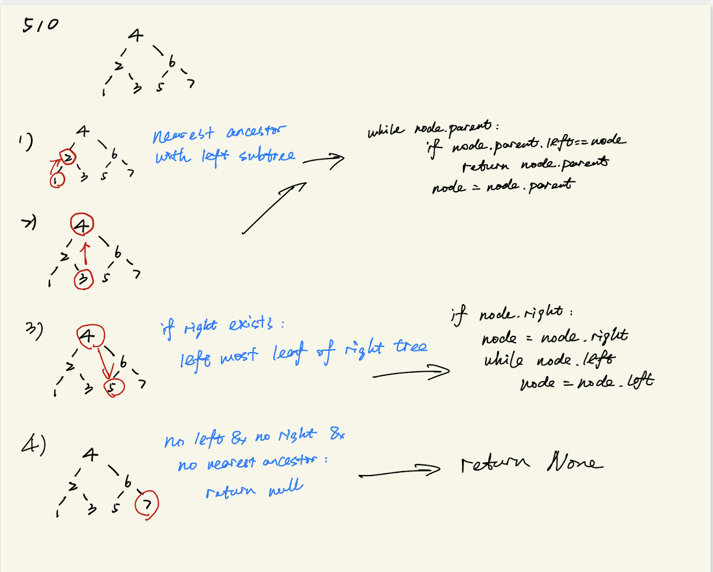

# Binary Tree 总结

## 总结

- 如何选择Top Down还是Buttom Up
Top Down以参数信息，用一个全局 变量来记录最终结果, 通常不需要返回值,思维上更straight forward, 对于输出完整path的题，top down更实用, 如果依赖subtree的结果，用bottom up

- DFS/BFS 如何选择
Depth first(stack): pre-order / in-order / post-order， breadth first(queue): level order

- 考虑清楚什么时候要用helper function

## 题型分类

### Binary Search Tree  

要考虑和root比大小，根据大小选择缩小范围，例如左子树和右子树
- [Convert Sorted Array to Binary Search Tree](#convert-sorted-array-to-binary-search-tree)
- [Lowest Common Ancestor of a Binary Search Tree](#lowest-common-ancestor-of-a-binary-search-tree)
- [Range Sum of BST](#range-sum-of-bst)
- [Construct Binary Search Tree from Preorder Traversal](#construct-binary-search-tree-from-preorder-traversal)

### DFS相关 / depth 相关

- 了解postorder, preorder, inorder的结构特点
- [Construct Binary Tree from Preorder and Inorder Traversal](#construct-binary-search-tree-from-preorder-traversal)
- [Construct Binary Tree from Inorder and Postorder Traversal](#construct-binary-tree-from-inorder-and-postorder-traversal)
- [Construct Binary Tree from Preorder and Postorder Traversal](#construct-binary-tree-from-preorder-and-postorder-traversal)
- 考虑使用helper function
- [Symmetric Tree](#symmetric-tree)
- [Maximum Depth of Binary Tree](#maximum-depth-of-a-tree)
- [Maximum Difference Between Node and Ancestor](#maximum-difference-between-node-and-ancestor)(需要有public的变量，同时记录重要变量)
- [Sum Root to Leaf Numbers](#sum-root-to-leaf-numbers)(有public变量)
- [Longest Univalue Path](#longest-univalue-path)(有public变量，而且同时需要记录母节点，决定往左计算还是往右计算)
- 不需要helper function，而且写法可以很优雅，比较典型的树的dfs写法,
- 主要思考current status和下个status之间的关系如何转化
- [Path Sum](#path-sum)
- [Same Tree](#same-tree)
- [Invert Binary Tree](#invert-binary-tree)
- [Subtree of Another Tree](#subtree-of-another-tree)
- [Balanced Binary Tree](#balanced-binary-tree)
- [Minimum Depth of Binary Tree](#minimum-depth-of-binary-tree)
- [Binary Tree Paths](#binary-tree-paths)
- [Sum of Left Leaves](#sum-of-left-leaves)
- [Convert Sorted List to Binary Search Tree](#convert-sorted-list-to-binary-search-tree)
- [Merge Two Binary Trees](#merge-two-binary-trees)
- [Sum Root to Leaf Numbers](#sum-root-to-leaf-numbers)
- [Flip Equivalent Binary Trees](#flip-equivalent-binary-trees)
- [Trim a Binary Search Tree](#trim-a-binary-search-tree)
- [Lowest Common Ancestor of a Binary Tree](#lowest-common-ancestor-of-a-binary-tree)
- [Binary Tree Maximum Path Sum](#binary-tree-maximum-path-sum)
- [Leaf-Similar Trees](#leaf-similar-trees)
- [Two Sum IV - Input is a BST](#two-sum-iv---input-is-a-bst)
- [Deepthest Leaves Sum](#deepest-leaves-sum)
- [Univalued Binary Tree](#univalued-binary-tree)
- [Leaf-Similar Trees](#leaf-similar-trees)
- [Delete Leaves with a Given Value](#delete-leaves-with-a-given-value)
- [Distribute Coins in Binary Tree](#distribute-coins-in-binary-tree)
- [Find a Corresponding Node of a Binary Tree in a Clone of That Tree](#find-a-corresponding-node-of-a-binary-tree-in-a-clone-of-that-tree)
- [path sum III](#path-sum-iii)
- [Closest Binary Search Tree Value](#closest-binary-search-tree-value)
- [Clone Binary Tree With Random Pointer](#clone-binary-tree-with-random-pointer)
- [Smallest Subtree with all the Deepest Nodes](#smallest-subtree-with-all-the-deepest-nodes)
- [Maximum Binary Tree]()
- [Delete Node in a BST](#delete-node-in-a-bst)
- [Binary Tree Longest Consecutive Sequence](#binary-tree-longest-consecutive-sequence)
- [Find Leaves of Binary Tree](#find-leaves-of-binary-tree)
- [Boundary of Binary Tree](#boundary-of-binary-tree)
- [Maximum Product of Splitted Binary Tree]()

### Backtracking

- [Path Sum II](#path-sum-ii)
- [Sum Root to Leaf Numbers](#sum-root-to-leaf-numbers)

### 有转角

- [Diameter of Binary Tree](#diameter-of-binary-tree)

### Complete Binary Tree

- [Count Complete Tree Nodes](#count-complete-tree-nodes) 

### BFS

- [N-ary Tree Level Order Traversal](#n-ary-tree-level-order-traversal)
- [Populating Next Right Pointers in Each Node](#populating-next-right-pointers-in-each-node)
- [Binary Tree Level Order Traversal II](#binary-tree-level-order-traversal-ii)
- [Binary Tree Right Side View](#binary-tree-right-side-view)
- [Cousins in Binary Tree](#cousins-in-binary-tree)
- [Binary Tree Vertical Order Traversal](#binary-tree-vertical-order-traversal)
- [Maximum Width of Binary Tree](#maximum-width-of-binary-tree)
- [Populating Next Right Pointers in Each Node](#populating-next-right-pointers-in-each-node)
- [Minimum Depth of Binary Tree](#minimum-depth-of-binary-tree)
- [Find Bottom Left Tree Value](#find-bottom-left-tree-value)
- [Find Largest Value in Each Tree Row](#find-largest-value-in-each-tree-row)

### hash

- [Two Sum IV - Input is a BST](#two-sum-iv---input-is-a-bst)

### Iterative

- [Closest Binary Search Tree Value](#closest-binary-search-tree-value)
- [Inorder Successor in BST](#inorder-successor-in-bst)
- [Lowest Common Ancestor of a Binary Tree III](#lowest-common-ancestor-of-a-binary-tree-iii)

### dfs/bfs同时使用

- [All Nodes Distance K in Binary Tree](#all-nodes-distance-k-in-binary-tree)

### greedy方法

- [Binary Tree Cameras](#binary-tree-cameras)

### 必备模版

### pre-order

输出root - 输出left子结点 - 输出right子节点

```python
def pre_order(root):
    if not root:
        return
    print(root.val)
    pre_order(root.left)
    pre_order(root.right)
```

### In-order

探到left子节点-上一级root结点-right子节点

```python
def pre_order(root):
    if not root:
        return
    pre_order(root.left)
    print(root.val)
    pre_order(root.right)
```

### post-order

探到left子结点-上一级root结点的right子节点-root结点

```python
def pre_order(root):
    if not root:
        return
    post_order(root.left)
    post_order(root.right)
    print(root.val)
```

### level-order

O(n)

```python
# queue top down
from collections import deque
def level_order(root):
    if not root: return []
    q = deque([root])
    output = []
    while q:
        head = q.popleft()
        if head.left:
            q.append(head.left)
        if head.right:
            q.append(head.right)        
        output.append(root.val)
    return output      
```

-----

### [Maximum Depth of a tree](https://leetcode.com/problems/maximum-depth-of-binary-tree/)

- reverse
- 选择要传的参数

```python
class Solution(object):
    def maxDepth(self, root):
        """
        :type root: TreeNode
        :rtype: int
        """
        return self.helper(root,0)
        
        
    def helper(self, root, max_depth):
        if root is None:
            return 0
        left = self.helper(root.left,max_depth)
        right = self.helper(root.right,max_depth)
        
#
        return max(left,right) + 1
```

### [Binary Tree Paths](https://leetcode.com/problems/binary-tree-paths/)

```python
class Solution(object):
    def binaryTreePaths(self, root):
        """
        :type root: TreeNode
        :rtype: List[str]
        """
        def dfs(root, path):
            if not root: return
            if not root.left and not root.right: 
                return res.append('->'.join(path))
            if root.left: dfs(root.left, path + [str(root.left.val)])
            if root.right: dfs(root.right, path + [str(root.right.val)])
        if not root: return []
        res = []
        dfs(root, [str(root.val)])
        return res
```

### Minimum subtree

```python
# traverse and conquer
class solution(object):inu
    import math
    
    def minsum(self,root):
        minsum = math.inf
        minroot = None
        self.helper(root)
        return minsum
    
#     ouput subtree sum
    def helper(self,root):
        if root is None:
            return 0
        
        sum = helper(root.left) + helper(root.right) + root.val
        if minsum < sum:
            minsum = min(left,right)
            minroot = root
        return sum
```


```python
# devide and conquer
class solution(object):
    def minsum(self,root):
        return self.helper(root, - math.inf, None)
        
    def helper(self,root,minsum,sum,minroot):
        if root is None:
            return 0,0,root
        minsum, sum, minroot = helper(root.left,minsum,sum,minroot) + helper(root.right,minsum,sum,minroot) + root.val
        if minsum > sum: 
            minsum = sum
            minroot = root.val
        return minsum, sum, minroot

```

### [Balanced Binary Tree](https://leetcode.com/problems/balanced-binary-tree/)

- recursive
- dfs
- 使用全局变量的时候可以用res = [] 引用list

```python
class Solution(object):
    def isBalanced(self, root):
        """
        :type root: TreeNode
        :rtype: bool
        """
        def dfs(root):
            if not root: return 0
            l_depth = dfs(root.left)
            r_depth = dfs(root.right)
            if abs(l_depth - r_depth) > 1: 
                res[0] = False
            return max(l_depth, r_depth) + 1        
        

        res = [True]    
        dfs(root)
        return res[0]
```

### Subtree with Maximum Average

```python
class solution(object):
    def maxavg(self, root):
        new_sum, new_size, maxavg, target = self.helper(root,0,0,0,None)
        return target
        
    def helper(self, root, sum, size, maxavg, target):
#         return sum, size, maxavg, target
        if root is None:
            return 0, 0, 0, root
        
        left_sum, left_size, left_maxavg, left_target = self.helper(root.left, sum, size, maxavg, target)
        right_sum, right_size, right_maxavg, right_target = self.helper(root.right, sum,size, maxavg, target)

        
        new_sum = root.val + left_sum + right_sum
        new_size = 1 + left_size + right_size
        
        if mew_sum / new_size > maxavg:
            maxavg = new_sum / new_size
            target = root.val
            
            
        return new_sum, new_size, maxavg, target


```

### Flatten Binary Tree to Linked List

### Lower Common Ancestor

### Binary Tree Longest Consecutive Sequence

### [Path Sum](https://leetcode.com/problems/path-sum/)

```python
class Solution(object):
    def hasPathSum(self, root, sum):
        """
        :type root: TreeNode
        :type sum: int
        :rtype: bool
        """
        if not root: return False
        if not root.left and not root.right and root.val == sum: return True
        return self.hasPathSum(root.left, sum - root.val) or self.hasPathSum(root.right, sum - root.val) 
```

### [Path Sum II](https://leetcode.com/problems/path-sum-ii/)

```python
class Solution(object):
    def pathSum(self, root, sum):
        """
        :type root: TreeNode
        :type sum: int
        :rtype: List[List[int]]
        """
        def dfs(root, target, path):
            if not root: return
            if not root.left and not root.right and target == root.val:
                res.append(path + [root.val])
                print(path + [root.val])
            if root.left: dfs(root.left, target - root.val, path + [root.val])
            if root.right: dfs(root.right, target - root.val, path + [root.val])

        res = []
        dfs(root, sum, [])
        return res
```

### [Cousins in Binary Tree](https://leetcode.com/problems/cousins-in-binary-tree/)

```python
class Solution(object):
    def isCousins(self, root, x, y):
        """
        :type root: TreeNode
        :type x: int
        :type y: int
        :rtype: bool
        """
        if not root: return False
        q = [root]
        
        while q:
            size, level = len(q), set()
            for i in range(size):
                cur = q.pop(0)
                level.add(cur.val)
                if cur.left: q.append(cur.left)
                if cur.right: q.append(cur.right)
                if cur.left and cur.right :
                    if (cur.left.val == x and cur.right.val == y) or (cur.left.val == y and cur.right.val == x): return False
            if x in level and y in level: return True
        return False
```

### [Find Leaves of Binary Tree](https://leetcode.com/problems/find-leaves-of-binary-tree/)

```python
class Solution(object):
    def findLeaves(self, root):
        """
        :type root: TreeNode
        :rtype: List[List[int]]
        """
        def dfs(root):
            if not root: return -1
            left, right = dfs(root.left), dfs(root.right)
            level = max(left, right) + 1
            # print(root.val, level)
            if len(res)-1 < level: res.append([root.val])
            else: res[level].append(root.val)
            return level        
        
        res = []
        dfs(root)
        return res
```

### [Symmetric Tree](https://leetcode.com/problems/symmetric-tree/)

- recursive
- 注意要多建一个helper

```python
class Solution(object):
    from collections import deque
    def isSymmetric(self, root):
        """
        :type root: TreeNode
        :rtype: bool
        """
        if not root: return True
        return self.isSymmetricTree(root.left, root.right)
        
        
    def isSymmetricTree(self, left, right):
        if not left and not right: return True
        if (not left) or (not right): return False
        return (left.val == right.val) and self.isSymmetricTree(left.left, right.right) and self.isSymmetricTree(left.right, right.left)

```

### [Same Tree](https://leetcode.com/problems/same-tree/)

- 熟练用到recursive方法
- 优化写代码的方式

```python
class Solution(object):
    def isSameTree(self, p, q):
        """
        :type p: TreeNode
        :type q: TreeNode
        :rtype: bool
        """
        if not p and not q: return True
        if (not p) or (not q): return False
        return p.val == q.val and self.isSameTree(p.left, q.left) and self.isSameTree(p.right, q.right)
```

### [Minimum Diff in Binary Search Tree](https://leetcode.com/problems/minimum-distance-between-bst-nodes/)

```python
class Solution(object):
    def minDiffInBST(self, root):
        """
        :type root: TreeNode
        :rtype: int
        """
        res = []
        self.helper(root,res)
        diff = float("inf")
        for i in range(len(res)-1):
            diff = min(diff, res[i+1]-res[i])
        return diff
    
    def helper(self, root, res):
        if root is None:
            return
        self.helper(root.left,res)
        res.append(root.val)
        self.helper(root.right,res)
```

```python
class Solution(object):
    def minDiffInBST(self, root):
        """
        :type root: TreeNode
        :rtype: int
        """
        prev = [float("inf")]
        diff = [float("inf")]
        self.helper(root, prev, diff)
        return diff[0]

    def helper(self, root, prev, diff):
        if root is None:
            return
        self.helper(root.left, prev, diff)
        if prev[0] != float("inf"):
            diff[0] = min(diff[0], root.val - prev[0])
        prev[0] = root.val
        self.helper(root.right, prev, diff)
```

### [Diameter of Binary Tree](https://leetcode.com/problems/diameter-of-binary-tree/)

```python
class Solution(object):
    def diameterOfBinaryTree(self, root):
        """
        :type root: TreeNode
        :rtype: int
        """
        if not root:
            return 0
        res = [0]
        self.helper(root, res)
        return res[0] - 1
    
    def helper(self,root, res):
        if not root:
            return 0
        left = self.helper(root.left, res)
        right = self.helper(root.right, res)
        res[0] = max(res[0], left + right + 1)
        return max(left, right) + 1
```

### [Flatten Binary Tree to Linked List](https://leetcode.com/problems/flatten-binary-tree-to-linked-list/)

```python
class Solution:
    def flatten(self, root):
        """
        Do not return anything, modify root in-place instead.
        """
        prev = [None]
        
        def dfs(root, prev):
            if not root: return
            left, right = root.left, root.right
            if prev[0]:
                prev[0].left = None
                prev[0].right = root
            prev[0] = root
            dfs(left, prev)
            dfs(right, prev)
        
        dfs(root, prev)
```

### [Binary Tree Level Order Traversal II](#https://leetcode.com/problems/binary-tree-level-order-traversal-ii/)

```python
class Solution(object):
    def levelOrderBottom(self, root):
        """
        :type root: TreeNode
        :rtype: List[List[int]]
        """
        if not root: return
        q = [root]
        res = []
        while q:
            size, level = len(q), []
            for i in range(size):
                cur = q.pop(0)
                level.append(cur.val)
                if cur.left: q.append(cur.left)
                if cur.right: q.append(cur.right)
            res = [level] + res
        return res
```

### [Convert Sorted Array to Binary Search Tree](https://leetcode.com/problems/convert-sorted-array-to-binary-search-tree/)

- BST
- Recursive, 想清楚要不要helper function

```python
class Solution(object):
    def sortedArrayToBST(self, nums):
        """
        :type nums: List[int]
        :rtype: TreeNode
        """
        if not nums: return 
        mid = len(nums) // 2
        root = TreeNode(nums[mid])
        root.left = self.sortedArrayToBST(nums[:mid])
        root.right = self.sortedArrayToBST(nums[mid + 1:])
        return root       
```

### [Balanced Binary Tree](https://leetcode.com/problems/balanced-binary-tree/)

```python
class Solution(object):
    def isBalanced(self, root):
        """
        :type root: TreeNode
        :rtype: bool
        """
        def dfs(root):
            if not root: return 0
            left = dfs(root.left)
            right = dfs(root.right)
            if abs(left - right) > 1: flag[0] = False
            return max(left,right) + 1
        
        flag = [True]
        dfs(root)
        return flag[0]
```

### [Minimum Depth of Binary Tree](https://leetcode.com/problems/minimum-depth-of-binary-tree/)

- recursive
- root.left / root.right 注意特点


```python
class Solution(object):
    def minDepth(self, root):
        """
        :type root: TreeNode
        :rtype: int
        """
        if not root: return 0
        if root.left and root.right: 
            return min(self.minDepth(root.left), self.minDepth(root.right)) + 1
        else:
            return max(self.minDepth(root.left), self.minDepth(root.right)) + 1
```

### [Invert Binary Tree](https://leetcode.com/problems/invert-binary-tree/)

```python
class Solution(object):
    def invertTree(self, root):
        """
        :type root: TreeNode
        :rtype: TreeNode
        """
        if not root: return 
        left_root = self.invertTree(root.left)
        right_root = self.invertTree(root.right)
        root.left, root.right = right_root, left_root
        return root
```

### [Lowest Common Ancestor of a Binary Search Tree](https://leetcode.com/problems/lowest-common-ancestor-of-a-binary-search-tree/)

```python
class Solution(object):
    def lowestCommonAncestor(self, root, p, q):
        """
        :type root: TreeNode
        :type p: TreeNode
        :type q: TreeNode
        :rtype: TreeNode
        """
        if not root: 
            return 
        if q.val >= root.val >= p.val or p.val >= root.val >=q.val:
            return root
        elif q.val < root.val and p.val < root.val:
            return self.lowestCommonAncestor(root.left, p, q) 
        else:
            return self.lowestCommonAncestor(root.right, p, q)
```

### [Inorder Successor in BST](https://leetcode.com/problems/inorder-successor-in-bst/)

```python
class Solution(object):
    def inorderSuccessor(self, root, p):
        """
        :type root: TreeNode
        :type p: TreeNode
        :rtype: TreeNode
        """
        res = None
        while root:
            if p.val < root.val:
                res = root
                root = root.left
            else:
                root = root.right
        return res
```

### [Sum of Left Leaves](https://leetcode.com/problems/sum-of-left-leaves/)

```python
class Solution(object):
    def sumOfLeftLeaves(self, root):
        """
        :type root: TreeNode
        :rtype: int
        """
        
        
        def helper(root):
            if not root: return
            if root.left and not root.left.left and not root.left.right:
                
                res.append(root.left.val)
            helper(root.left)
            helper(root.right)           
            
        if not root: return 0
        res = []
        helper(root)
        return sum(res)
        
```

### [Binary Tree Right Side View](https://leetcode.com/problems/binary-tree-right-side-view/)

```python
class Solution(object):
    def rightSideView(self, root):
        """
        :type root: TreeNode
        :rtype: List[int]
        """
        if not root: return []
        q = [root]
        res = []
        while q:
            size, level = len(q), []
            for i in range(size):
                cur = q.pop(0)
                level.append(cur.val)
                if cur.left: q.append(cur.left)
                if cur.right: q.append(cur.right)
            res.append(level[-1])
        return res
```

### [Range Sum of BST](https://leetcode.com/problems/range-sum-of-bst/)

- 注意利用bst的性质

```python
class Solution(object):
    def rangeSumBST(self, root, L, R):
        """
        :type root: TreeNode
        :type L: int
        :type R: int
        :rtype: int
        """
        if not root:
            return 0
        sum = 0
        if root.val > L:
            sum += self.rangeSumBST(root.left, L, R)
        if root.val < R:
            sum += self.rangeSumBST(root.right, L, R)
        if L <= root.val <= R:
            sum += root.val     
        return sum
```

### [Convert Sorted List to Binary Search Tree](https://leetcode.com/problems/convert-sorted-list-to-binary-search-tree/)

```python
class Solution(object):
    def sortedListToBST(self, head):
        """
        :type head: ListNode
        :rtype: TreeNode
        """
        if not head: return
        if not head.next: return TreeNode(head.val)
        prev, slow, fast = ListNode(None), head, head
        prev.next = head
        while fast and fast.next:
            prev, slow, fast = prev.next, slow.next, fast.next.next
        root = TreeNode(slow.val)
        prev.next = None
        next = slow.next
        slow.next = None
        root.left = self.sortedListToBST(head)
        root.right = self.sortedListToBST(next)
        return root
```

### [N-ary Tree Level Order Traversal](https://leetcode.com/problems/n-ary-tree-level-order-traversal/)

```python
class Solution(object):
    def levelOrder(self, root):
        """
        :type root: Node
        :rtype: List[List[int]]
        """
        if not root: return []
        q = [root]
        res = []
        while q:
            level, size = [], len(q)
            for i in range(size):
                root = q.pop(0)
                level.append(root.val)
                for i in root.children:
                    q.append(i)
            res.append(level)
        return res
```

### [Subtree of Another Tree](https://leetcode.com/problems/subtree-of-another-tree/)

- check is same tree让整个code写的更加整洁

```python
class Solution(object):
    def isSubtree(self, s, t):
        """
        :type s: TreeNode
        :type t: TreeNode
        :rtype: bool
        """
        if not t and not s: return True
        if not s or not s: return False
        return self.isSame(s, t) or self.isSubtree(s.left, t) or self.isSubtree(s.right, t)
    
    def isSame(self,s, t):
        if not s and not t: return True
        if not s or not t: return False
        if s.val != t.val: return False
        return self.isSame(s.left, t.left) and self.isSame(s.right, t.right)
```

### [Merge Two Binary Trees](https://leetcode.com/problems/merge-two-binary-trees/)

```python
class Solution(object):
    def mergeTrees(self, t1, t2):
        """
        :type t1: TreeNode
        :type t2: TreeNode
        :rtype: TreeNode
        """
        if not t1 and not t2: return t1
        if t1 and not t2: return t1
        if not t1 and t2: return t2
        t1.val = t1.val + t2.val
        t1.left = self.mergeTrees(t1.left, t2.left)
        t1.right = self.mergeTrees(t1.right, t2.right)
        return t1
```

### [Maximum Depth of N-ary Tree](https://leetcode.com/problems/maximum-depth-of-n-ary-tree/)

```python
class Solution(object):
    def maxDepth(self, root):
        """
        :type root: Node
        :rtype: int
        """
        if not root: return 0
        if not root.children: return 1
        max_depth = -1
        for child in root.children:
            max_depth = max(max_depth , self.maxDepth(child))
        return max_depth + 1
```

### [Binary Tree Vertical Order Traversal](https://leetcode.com/problems/binary-tree-vertical-order-traversal/)

```python
class Solution(object):
    def verticalOrder(self, root):
        """
        :type root: TreeNode
        :rtype: List[List[int]]
        """
        res = []
        min_pos, max_pos = 0, 0
        dic = {}
        q = [(root, 0)]
        if not root: return res
        while q: 
            cur, pos = q.pop(0)
            if pos not in dic.keys():
                dic[pos] = []
            dic[pos].append(cur.val)
            if cur.left:
                q.append((cur.left, pos - 1))
                min_pos = min(min_pos, pos - 1)
            if cur.right:
                q.append((cur.right, pos + 1))
                max_pos = max(max_pos, pos + 1)
        for pos in range(min_pos, max_pos + 1):
            if pos in dic.keys(): res.append(dic[pos])
        return res
```

### [Vertical Order Traversal of a Binary Tree](https://leetcode.com/problems/vertical-order-traversal-of-a-binary-tree/)

- 考虑在最后输出的时候进行比大小

```python
class Solution(object):
    def verticalTraversal(self, root):
        """
        :type root: TreeNode
        :rtype: List[List[int]]
        """
        from collections import defaultdict
        d = defaultdict(list)
        q = [(root, 0, 0)]
        min_pos, max_pos = 0, 0
        while q:
            size = len(q)
            for _ in range(size):
                cur, pos, level = q.pop(0)
                d[pos].append((cur.val, level))
                if cur.left: 
                    q.append((cur.left, pos - 1, level + 1))
                    min_pos = min(min_pos, pos - 1)
                if cur.right: 
                    q.append((cur.right, pos + 1, level + 1))
                    max_pos = max(max_pos, pos + 1)
        res = []
        for i in range(min_pos, max_pos + 1):
            res.append([node[0] for node in sorted(d[i], key = lambda x: (x[1], x[0]))])
            
        return res
```

### [Populating Next Right Pointers in Each Node](https://leetcode.com/problems/populating-next-right-pointers-in-each-node/)

```python
class Solution(object):
    def connect(self, root):
        """
        :type root: Node
        :rtype: Node
        """
        if not root: return root
        q = [root]
        while q:
            size = len(q)
            prev = TreeNode(None)
            for i in range(size):
                cur = q.pop(0)
                prev.next = cur
                if cur.left: q.append(cur.left)
                if cur.right: q.append(cur.right)
                prev = cur
            prev.next = None
        return root
```

### [Sum Root to Leaf Numbers](https://leetcode.com/problems/sum-root-to-leaf-numbers/)

```python
class Solution(object):
    def sumNumbers(self, root):
        """
        :type root: TreeNode
        :rtype: int
        """
        
        
        def dfs(root, cursum):
            if not root: return
            if not root.left and not root.right:
                res.append(cursum * 10 + root.val)
                return
            dfs(root.left, cursum * 10 + root.val)
            dfs(root.right, cursum * 10 + root.val)
        
        res = []
        dfs(root,0)
        return sum(res)
```

### [Construct Binary Tree from Preorder and Inorder Traversal](https://leetcode.com/problems/construct-binary-tree-from-preorder-and-inorder-traversal/)

```python
class Solution(object):
    def buildTree(self, preorder, inorder):
        """
        :type preorder: List[int]
        :type inorder: List[int]
        :rtype: TreeNode
        """
        if len(inorder) == 0: return
        if len(inorder) == 1: return TreeNode(preorder[0])
        rval = preorder[0]
        root = TreeNode(rval)
        inorder_rval = inorder.index(rval)
        left_in = inorder[:inorder_rval]
        right_in = inorder[inorder_rval + 1:]
        left_pre = preorder[1:len(left_in) + 1]
        right_pre = preorder[len(left_in) + 1:]
        
        root.left = self.buildTree(left_pre, left_in)
        root.right = self.buildTree(right_pre, right_in)
        return root
```

### [Construct Binary Tree from Inorder and Postorder Traversal](https://leetcode.com/problems/construct-binary-tree-from-inorder-and-postorder-traversal/)

```python
class Solution(object):
    def buildTree(self, inorder, postorder):
        """
        :type inorder: List[int]
        :type postorder: List[int]
        :rtype: TreeNode
        """
        if len(inorder) == 0: return
        rval = postorder[-1]
        root = TreeNode(rval)
        inorder_rval = inorder.index(rval)
        inorder_left = inorder[:inorder_rval]
        inorder_right = inorder[inorder_rval + 1:]
        postorder_left = postorder[:len(inorder_left)]
        postorder_right = postorder[len(inorder_left): - 1]
        root.left = self.buildTree(inorder_left, postorder_left)
        root.right = self.buildTree(inorder_right, postorder_right)
        return root
```

### [Construct Binary Tree from Preorder and Postorder Traversal](https://leetcode.com/problems/construct-binary-tree-from-preorder-and-postorder-traversal/)

```python
class Solution(object):
    def constructFromPrePost(self, pre, post):
        """
        :type pre: List[int]
        :type post: List[int]
        :rtype: TreeNode
        """
        if not pre: return
        root = TreeNode(pre[0])
        if len(post) == 1: return root 
        right_s = post[-2]
        left_e = pre.index(right_s)
        left_pre = pre[1 : left_e]
        left_post = post[:len(left_pre)]
        right_pre = pre[len(left_pre) + 1:]
        right_post = post[len(left_pre):-1]
        root.left = self.constructFromPrePost(left_pre, left_post)
        root.right = self.constructFromPrePost(right_pre, right_post)
        return root
```

### [Longest Univalue Path](https://leetcode.com/problems/longest-univalue-path/)

```python
class Solution(object):
    def longestUnivaluePath(self, root):
        """
        :type root: TreeNode
        :rtype: int
        """   

        def dfs(cur,parent):
            if not cur: return 0
            left = dfs(cur.left, cur)
            right = dfs(cur.right, cur)
            res[0] = max(res[0], left + right)
            return max(left, right) + 1 if cur.val == parent.val else 0
        
        res = [0]
        dfs(root, TreeNode(None))
        return res[0]
```

### [Two Sum IV - Input is a BST](https://leetcode.com/problems/two-sum-iv-input-is-a-bst/)

```python
class Solution(object):
    def findTarget(self, root, k):
        """
        :type root: TreeNode
        :type k: int
        :rtype: bool
        """
        
        def dfs(root, k):
            if not root: return 
            if root.val in s: return True
            else: s.add(k - root.val)
            return dfs(root.left,k) or dfs(root.right, k)
        
        s = set()
        return dfs(root, k)
```

### [Closest Binary Search Tree Value](https://leetcode.com/problems/closest-binary-search-tree-value/)

```python
class Solution(object):
    def closestValue(self, root, target):
        """
        :type root: TreeNode
        :type target: float
        :rtype: int
        """
        r = root.val
        while root:
            if abs(root.val - target) < abs(r - target):
                r = root.val
            root = root.left if target < root.val else root.right
        return r
```

### [Trim a Binary Search Tree](https://leetcode.com/problems/trim-a-binary-search-tree/)

```python
class Solution(object):
    def trimBST(self, root, L, R):
        """
        :type root: TreeNode
        :type L: int
        :type R: int
        :rtype: TreeNode
        """
        if not root: return
        if root.val > R: return self.trimBST(root.left, L, R)
        if root.val < L: return self.trimBST(root.right, L, R)
        root.left = self.trimBST(root.left, L, R)
        root.right = self.trimBST(root.right, L, R)
        return root
```

### [Flip Equivalent Binary Trees](https://leetcode.com/problems/flip-equivalent-binary-trees/)

```python
class Solution(object):
    def flipEquiv(self, root1, root2):
        """
        :type root1: TreeNode
        :type root2: TreeNode
        :rtype: bool
        """
        if not root1 and not root2: return True
        if not root1 or not root2: return False
        res = self.flipEquiv(root1.left, root2.left) and self.flipEquiv(root1.right, root2.right)
        res = res or (self.flipEquiv(root1.left, root2.right) and self.flipEquiv(root1.right, root2.left))
        return root1.val == root2.val and res
```

### [Lowest Common Ancestor of a Binary Tree](https://leetcode.com/problems/lowest-common-ancestor-of-a-binary-tree/)

```python
class Solution(object):
    def lowestCommonAncestor(self, root, p, q):
        """
        :type root: TreeNode
        :type p: TreeNode
        :type q: TreeNode
        :rtype: TreeNode
        """
        if not root: return None
        if root == p or root == q: return root
        left = self.lowestCommonAncestor(root.left, p, q)
        right = self.lowestCommonAncestor(root.right, p, q)
        if left and right:
            return root
        if not left:
            return right
        if not right:
            return left
```

### [Validate Binary Search Tree](https://leetcode.com/problems/validate-binary-search-tree/)

```python
class Solution(object):
    def isValidBST(self, root, lessThan = float('inf'), largerThan = float('-inf')):
        if not root:
            return True
        if root.val <= largerThan or root.val >= lessThan:
            return False
        return self.isValidBST(root.left, min(lessThan, root.val), largerThan) and \
               self.isValidBST(root.right, lessThan, max(root.val, largerThan))
```

### [Binary Tree Maximum Path Sum](https://leetcode.com/problems/binary-tree-maximum-path-sum/)

```python
class Solution(object):
    def maxPathSum(self, root):
        """
        :type root: TreeNode
        :rtype: int
        """
        def dfs(root):
            if not root: return 0
            left = right = 0
            if root.left: left = max(0, dfs(root.left))
            if root.right: right = max(0, dfs(root.right))
            res[0] = max(res[0], left + root.val + right)
            return max(left, right) + root.val
                
        res = [-float('inf')]
        dfs(root)
        return res[0]
```

### [Increasing Order Search Tree](https://leetcode.com/problems/increasing-order-search-tree/)

```python
class Solution(object):
    def increasingBST(self, root, tail = None):
        """
        :type root: TreeNode
        :rtype: TreeNode
        """
        if not root: return tail
        res = self.increasingBST(root.left, root)
        root.left = None
        root.right = self.increasingBST(root.right, tail)
        return res
```

### [Leaf-Similar Trees](https://leetcode.com/problems/leaf-similar-trees/)

```python
class Solution(object):
    def leafSimilar(self, root1, root2):
        """
        :type root1: TreeNode
        :type root2: TreeNode
        :rtype: bool
        """
        def dfs(root):
            if not root.left and not root.right:
                return [root.val]
            left = right = []
            if root.left: left = dfs(root.left)
            if root.right: right = dfs(root.right)
            return left + right 
            
        res1, res2 = dfs(root1), dfs(root2)
        if res1 == res2: return True
        return False
```

### [Maximum Difference Between Node and Ancestor](https://leetcode.com/problems/maximum-difference-between-node-and-ancestor/)

```python
class Solution(object):
    def maxAncestorDiff(self, root):
        """
        :type root: TreeNode
        :rtype: int
        """
        def dfs(root, small, large):
            if not root: return 
            res[0] = max(res[0], abs(root.val - small), abs(root.val - large))
            dfs(root.left, min(small, root.val), max(large, root.val))
            dfs(root.right, min(small, root.val), max(large, root.val))
            
        res = [0]
        dfs(root, root.val, root.val)
        return res[0]
```

### [Maximum Width of Binary Tree](https://leetcode.com/problems/maximum-width-of-binary-tree/)

```python
class Solution(object):
    def widthOfBinaryTree(self, root):
        """
        :type root: TreeNode
        :rtype: int
        """
        q = [(root, 0)]
        res = 0
        while q:
            size = len(q)
            _, head_pos = q[0]
            for _ in range(size):
                cur, pos = q.pop(0)
                if cur.left: q.append((cur.left, 2 * pos))
                if cur.right: q.append((cur.right, 2 * pos + 1))
            res = max(res, pos - head_pos + 1)
        return res
```

### [Count Complete Tree Nodes](https://leetcode.com/problems/count-complete-tree-nodes/)

```python
# Solution 1: Brute Force
# Time: (O(nlogn))    
# Space: ()
class Solution(object):
    def countNodes(self, root):
        return 1 + self.countNodes(root.right) + self.countNodes(root.left) if root else 0
```

### [Sum Root to Leaf Numbers](https://leetcode.com/problems/sum-root-to-leaf-numbers/)

```python
class Solution(object):
    def sumNumbers(self, root):
        """
        :type root: TreeNode
        :rtype: int
        """
        def dfs(root, path):
            if not root: return
            if not root.left and not root.right:
                res[0] +=int(''.join(path))
            if root.left: dfs(root.left, path + [str(root.left.val)])
            if root.right: dfs(root.right, path + [str(root.right.val)])
        if not root: return 0
        res = [0]
        dfs(root, [str(root.val)])
        return res[0]
```

### [Populating Next Right Pointers in Each Node](https://leetcode.com/problems/populating-next-right-pointers-in-each-node/)

Time: O(n)
Space: O(n)

```python
class Solution(object):
    def connect(self, root):
        """
        :type root: Node
        :rtype: Node
        """
        if not root: return
        q = [root]
        while q:
            size, level = len(q), []
            for i in range(size):
                cur = q.pop(0)
                level.append(cur)
                if cur.left: q.append(cur.left)
                if cur.right: q.append(cur.right)
            for pre, post in zip(level, level[1:]):
                pre.next = post
        return root
```

### [All Nodes Distance K in Binary Tree](https://leetcode.com/problems/all-nodes-distance-k-in-binary-tree/)

dfs和bfs同时使用

```python
# Definition for a binary tree node.
# class TreeNode(object):
#     def __init__(self, x):
#         self.val = x
#         self.left = None
#         self.right = None

class Solution(object):
    def distanceK(self, root, target, K):
        """
        :type root: TreeNode
        :type target: TreeNode
        :type K: int
        :rtype: List[int]
        """
        
        def dfs(root, prev):
            if not root: return
            if root.left: 
                left = dfs(root.left, root)
                G[root.val].append(left.val)
            if root.right: 
                right = dfs(root.right, root)
                G[root.val].append(right.val)
            G[root.val].append(prev.val)
            return root
   
        from collections import defaultdict
        G = defaultdict(list)
        dfs(root, TreeNode(None))
        q = [target.val]
        visited = set([target.val])
        while q:
            if K == 0: return [i for i in q if i is not None]
            size = len(q)
            for _ in range(size):
                cur = q.pop(0)
                for i in G[cur]:
                    if i not in visited:
                        q.append(i)
                        visited.add(i)
            K -= 1
        return []
     
```

[Two Sum IV - Input is a BST]

```python
class Solution(object):
    def findTarget(self, root, k):
        """
        :type root: TreeNode
        :type k: int
        :rtype: bool
        """
        def traverse(root):
            if not root: return False
            if k - root.val in s: return True
            s.add(root.val)
            return traverse(root.left) or traverse(root.right)
        s = set()
        return traverse(root)
```

### [Most Frequent Subtree Sum](https://leetcode.com/problems/most-frequent-subtree-sum/)

```python
class Solution(object):
    def findFrequentTreeSum(self, root):
        """
        :type root: TreeNode
        :rtype: List[int]
        """
        def dfs(root):
            if not root: return 0
            left = right = 0
            if root.left: left = dfs(root.left)
            if root.right: right = dfs(root.right)
            val = left + right + root.val
            res[val] = res.get(val, 0) + 1
            return val
        
        res = {}
        dfs(root)
        return [val for val, count in res.items() if count == max(res.values())]
```

### [Binary Tree Cameras](https://leetcode.com/problems/binary-tree-cameras/)

```python
class Solution(object):
    def minCameraCover(self, root):
        self.res = 0
        def dfs(root):
            if not root: return 2
            l, r = dfs(root.left), dfs(root.right)
            if l == 0 or r == 0:
                self.res += 1
                return 1
            return 2 if l == 1 or r == 1 else 0
        return (dfs(root) == 0) + self.res
```

### [Deepest Leaves Sum](https://leetcode.com/problems/deepest-leaves-sum/)

```python
class Solution(object):
    def deepestLeavesSum(self, root):
        """
        :type root: TreeNode
        :rtype: int
        """
        def dfs(root, depth):
            if not root.left and not root.right:
                if depth + 1 > res[0]: 
                    res[0], res[1] = depth + 1, root.val
                elif depth + 1 == res[0]:
                    res[1] += root.val
                return
            if root.left: dfs(root.left, depth + 1)
            if root.right: dfs(root.right, depth + 1)
                
        res = [0,0]
        dfs(root, 0)
        return res[1]
        
        
```

### [Minimum Depth of Binary Tree](https://leetcode.com/problems/minimum-depth-of-binary-tree/)

```python
# BFS
class Solution(object):
    def minDepth(self, root):
        """
        :type root: TreeNode
        :rtype: int
        """
        if not root: return 0
        q = [(root, 1)]
        flag = False
        while q:
            size = len(q)
            for _ in range(size):
                cur, depth = q.pop(0)
                if not cur.left and not cur.right: 
                    flag = True
                    break
                if cur.left: q.append((cur.left, depth + 1))
                if cur.right: q.append((cur.right, depth + 1))
            if flag: break         
        return depth
```

```python
# DFS
class Solution:
    def minDepth(self, root):
        if not root:
            return 0
        if not root.left or not root.right:
            return 1+ max(self.minDepth(root.left), self.minDepth(root.right))
        return 1+ min(self.minDepth(root.left), self.minDepth(root.right))
```

### [Univalued Binary Tree](https://leetcode.com/problems/univalued-binary-tree/)

```python
class Solution(object):
    def isUnivalTree(self, root):
        """
        :type root: TreeNode
        :rtype: bool
        """
        if not root: return True
        res = True
        if root.left: res = res & self.isUnivalTree(root.left) & (root.val == root.left.val)
        if root.right: res = res & self.isUnivalTree(root.right) & (root.val == root.right.val)
        return res
```

### [Leaf-Similar Trees](https://leetcode.com/problems/leaf-similar-trees/)


```python
class Solution(object):
    def leafSimilar(self, root1, root2):
        """
        :type root1: TreeNode
        :type root2: TreeNode
        :rtype: bool
        """
        def dfs(root):
            if not root: return []
            if not root.left and not root.right:
                return [root.val]
            left = dfs(root.left)
            right = dfs(root.right)
            return left + right
        
        return dfs(root1) == dfs(root2)
```

### [Delete Leaves With a Given Value](https://leetcode.com/problems/delete-leaves-with-a-given-value/)

```python
class Solution(object):
    def removeLeafNodes(self, root, target):
        """
        :type root: TreeNode
        :type target: int
        :rtype: TreeNode
        """
        if not root: return 
        left = self.removeLeafNodes(root.left, target)
        right = self.removeLeafNodes(root.right, target)
        if not left and not right and target == root.val: return
        root.left, root.right = left, right
        return root
```

### [Distribute Coins in Binary Tree](https://leetcode.com/problems/distribute-coins-in-binary-tree/)

```python
class Solution(object):
    def distributeCoins(self, root):
        """
        :type root: TreeNode
        :rtype: int
        """
        def dfs(root):
            if not root: return 0
            left = dfs(root.left)
            right = dfs(root.right)
            res[0] += abs(left) + abs(right)
            return left + right + root.val - 1
        res = [0]
        dfs(root)
        return res[0]
```

### [Find Elements in a Contaminated Binary Tree](https://leetcode.com/problems/find-elements-in-a-contaminated-binary-tree/)

```python
class FindElements(object):

    def __init__(self, root):
        """
        :type root: TreeNode
        """
        self.root = root
        self.root = self._traverse(self.root, 0)
    
    def _traverse(self, root, val):
        if not root: return
        root.val = val
        if root.left: root.left = self._traverse(root.left, 2 * val + 1)
        if root.right: root.right = self._traverse(root.right, 2 * val + 2)
        return root
    
    def find(self, target):
        """
        :type target: int
        :rtype: bool
        """
        cur = target
        res = []
        while cur > 2:
            res = [cur] + res
            cur = (cur-1) / 2
        res = [cur] + res
        cur, i = self.root, 0
        while cur:
            if cur.val == target: return True
            if cur.left and cur.left.val == res[i]: cur = cur.left
            elif cur.right and cur.right.val == res[i]: cur = cur.right
            else: return False
            i += 1
```

### [Maximum Level Sum of a Binary Tree](https://leetcode.com/problems/maximum-level-sum-of-a-binary-tree/)

```python
class Solution(object):
    def maxLevelSum(self, root):
        """
        :type root: TreeNode
        :rtype: int
        """
        levelres = 0
        q = [root]
        sumres = -float('inf')
        count = 0
        while q:
            size, level = len(q), []
            count += 1
            for _ in range(size):
                cur = q.pop(0)
                if cur.left: q.append(cur.left)
                if cur.right: q.append(cur.right)
                level.append(cur.val)
            # print(sumlevel)
            if sumres < sum(level): 
                levelres = count
                sumres = sum(level)
        return levelres
```

### [Find Largest Value in Each Tree Row](https://leetcode.com/problems/find-largest-value-in-each-tree-row/)

```python
class Solution(object):
    def largestValues(self, root):
        """
        :type root: TreeNode
        :rtype: List[int]
        """
        res = []
        q = [root]
        if not root: return []
        while q:
            size, level = len(q), []
            for _ in range(size):
                cur = q.pop(0)
                if cur.left: q.append(cur.left)
                if cur.right: q.append(cur.right)
                level.append(cur.val)
            res.append(max(level))
        return res
```

### [Find Bottom Left Tree Value](https://leetcode.com/problems/find-bottom-left-tree-value/)

```python
class Solution(object):
    def findBottomLeftValue(self, root):
        """
        :type root: TreeNode
        :rtype: int
        """
        if not root: return 
        q = [root]
        while q:
            size, level = len(q), []
            for _ in range(size):
                cur = q.pop(0)
                if cur.left: q.append(cur.left)
                if cur.right: q.append(cur.right)
                level.append(cur.val)
        return level[0]
```

### [Find a Corresponding Node of a Binary Tree in a Clone of That Tree](https://leetcode.com/problems/find-a-corresponding-node-of-a-binary-tree-in-a-clone-of-that-tree/)

```python
class Solution(object):
    def getTargetCopy(self, original, cloned, target):
        """
        :type original: TreeNode
        :type cloned: TreeNode
        :type target: TreeNode
        :rtype: TreeNode
        """
        if not original: return 
        if original == target: return cloned
        left = right = None
        if original.left: 
            left = self.getTargetCopy(original.left, cloned.left, target)
        if original.right: 
            right = self.getTargetCopy(original.right, cloned.right, target)
        return left or right
            
```

# 1490
### [Clone N-ary Tree](https://leetcode.com/problems/clone-n-ary-tree/)

```python
class Solution(object):
    def cloneTree(self, root):
        """
        :type root: Node
        :rtype: Node
        """
        if not root: return 
        clonedroot = Node(root.val)
        for i in root.children:
                node = self.cloneTree(i)
                clonedroot.children.append(node)
        return clonedroot
```

### [Kth Smallest Element in a BST](https://leetcode.com/problems/kth-smallest-element-in-a-bst/)


```python
class Solution(object):
    def kthSmallest(self, root, k):
        """
        :type root: TreeNode
        :type k: int
        :rtype: int
        """
        def dfs(root):
            if not root: return
            dfs(root.left)
            res.append(root.val)
            dfs(root.right)
        
        res = []
        dfs(root)
        return res[k-1]
         
```

### [Path Sum III](https://leetcode.com/problems/path-sum-iii/)

presum + dfs

```python
class Solution(object):
    def pathSum(self, root, sum):
        """
        :type root: TreeNode
        :type sum: int
        :rtype: int
        """
        def dfs(root, cur):
            if not root: return 0
            cur += root.val
            res = d.get(cur-sum, 0)
            d[cur] = d.get(cur, 0) + 1
            res += dfs(root.left, cur) + dfs(root.right, cur)
            d[cur] = d[cur] - 1
            return res

        d = {0:1}
        return dfs(root, 0)
```

# 1008
### [Construct Binary Search Tree from Preorder Traversal](https://leetcode.com/problems/construct-binary-search-tree-from-preorder-traversal/)


```python
class Solution(object):
    def bstFromPreorder(self, preorder):
        """
        :type preorder: List[int]
        :rtype: TreeNode
        """
        if len(preorder) == 0: return
        root = TreeNode(preorder[0])
        rootval = preorder[0]
        i = 1
        while i < len(preorder) and preorder[i] < rootval: i += 1
        root.left = self.bstFromPreorder(preorder[1:i])
        root.right = self.bstFromPreorder(preorder[i:])
        return root
            
```

### [Closest Binary Search Tree Value](https://leetcode.com/problems/closest-binary-search-tree-value/)

```python
class Solution(object):
    def closestValue(self, root, target):
        """
        :type root: TreeNode
        :type target: float
        :rtype: int
        """
        def dfs(root):
            if not root: return 
            if res[0][0] > abs(root.val - target):
                res[0] = (abs(root.val - target), root.val)
            if root.val < target: dfs(root.right)
            else: dfs(root.left)
        
        res = [(float('inf'), 0)]
        dfs(root)
        return res[0][1]
            
```

### [Clone Binary Tree With Random Pointer](https://leetcode.com/problems/clone-binary-tree-with-random-pointer/)

```python
class Solution(object):
    def copyRandomBinaryTree(self, root):
        """
        :type root: Node
        :rtype: NodeCopy
        """
        def dfs(root):
            if not root:
                return
            if root in visited:
                return visited[root]
            node = NodeCopy(root.val, None, None, None)
            visited[root] = node
            node.left = dfs(root.left)
            node.right = dfs(root.right)
            node.random = dfs(root.random)
            return node
        
        visited = {}
        node = dfs(root)
        return node
```

### [Smallest Subtree with all the Deepest Nodes](https://leetcode.com/problems/smallest-subtree-with-all-the-deepest-nodes/)

```python
class Solution(object):
    def subtreeWithAllDeepest(self, root):
        """
        :type root: TreeNode
        :rtype: TreeNode
        """
        def dfs(root):
            if not root: return 0, None
            (l_height, lroot), (r_height, rroot) = dfs(root.left), dfs(root.right)
            if l_height > r_height: return l_height + 1, lroot
            elif l_height < r_height: return r_height + 1, rroot
            else: return l_height + 1, root
        
        return dfs(root)[1]
```

### [Sum of Root To Leaf Binary Numbers]

```python
class Solution(object):
    def sumRootToLeaf(self, root, val = 0):
        """
        :type root: TreeNode
        :rtype: int
        """
        if not root: return 0
        val = val * 2 + root.val
        if root.left == root.right: return val
        return self.sumRootToLeaf(root.left, val) + self.sumRootToLeaf(root.right, val)
```

```python
class Solution(object):
    def sumRootToLeaf(self, root, val = 0):
        """
        :type root: TreeNode
        :rtype: int
        """
        if not root: return 0
        val = val * 2 + root.val
        if root.left == root.right: return val
        return self.sumRootToLeaf(root.left, val) + self.sumRootToLeaf(root.right, val)
```

### [Check Completeness of a Binary Tree](https://leetcode.com/problems/check-completeness-of-a-binary-tree/)

```python
# bfs
class Solution(object):
    def isCompleteTree(self, root):
        """
        :type root: TreeNode
        :rtype: bool
        """
        q = [root]
        count = 1 if root else 0
        while q:
            cur = q.pop(0)
            if not cur: return count == 0
            count -= 1
            q.append(cur.left)
            q.append(cur.right)
            if cur.left: count += 1
            if cur.right: count += 1
        return True
```

### [Linked List in Binary Tree](https://leetcode.com/problems/linked-list-in-binary-tree/)

有两种方法可以做

- dfs：要记住整个是连续的不能断开，所以不能只用一个function就写完，需要考虑helper让他在开始的时候一起开始recursive
- dp： KMP pattern search

```python
class Solution(object):
    def isSubPath(self, head, root):
        """
        :type head: ListNode
        :type root: TreeNode
        :rtype: bool
        """
        def dfs(head, root):
            if not head: return True
            if not root: return False
            return head.val == root.val and (dfs(head.next, root.left) or dfs(head.next, root.right))
        
        if not head: return True
        if not root: return False
        return dfs(head, root) or self.isSubPath(head, root.left) or self.isSubPath(head, root.right)
```

```python
class Solution(object):

    def isSubPath(self, head, root):
        A, dp = [head.val], [0]
        i = 0
        node = head.next
        while node:
            while i and node.val != A[i]:
                i = dp[i - 1]
            i += node.val == A[i]
            A.append(node.val)
            dp.append(i)
            node = node.next

        def dfs(root, i):
            if not root: return False
            while i and root.val != A[i]:
                i = dp[i - 1]
            i += root.val == A[i]
            return i == len(dp) or dfs(root.left, i) or dfs(root.right, i)
        return dfs(root, 0)
```

### [Serialize and Deserialize BST](https://leetcode.com/problems/serialize-and-deserialize-bst/)

```python
class Codec:

    def serialize(self, root):
        """Encodes a tree to a single string.
        """
        if not root: return '#'
        return str(root.val) + ',' + self.serialize(root.left) + ',' + self.serialize(root.right) 

    def deserialize(self, data):
        """Decodes your encoded data to tree.
        """
        if not data: return 
        nodes = data.split(',')
        if nodes[0] == '#': return
        root = TreeNode(int(nodes[0]))
        for i in range(len(nodes)):
            if nodes[i] != '#' and int(nodes[i]) > int(nodes[0]): break
        root.left = self.deserialize(','.join(nodes[1:i]))
        root.right = self.deserialize(','.join(nodes[i:]))
        return root
```

### [Delete Node in a BST](https://leetcode.com/problems/delete-node-in-a-bst/)

```python
class Solution(object):    
    def deleteNode(self, root, key):
        if not root: return 
        print(root.val)
        if root.val < key: 
            root.right = self.deleteNode(root.right, key)
            return root
        elif root.val > key: 
            root.left = self.deleteNode(root.left, key)
            return root
        else: 
            if not root.right: return root.left
            cur = new_root = root.right
            while cur.left:
                cur = cur.left
            cur.left = root.left
            return new_root        
```

### [Equal Tree Partition](https://leetcode.com/problems/equal-tree-partition/)

```python
class Solution(object):
    def checkEqualTree(self, root):
        """
        :type root: TreeNode
        :rtype: bool
        """
        def nodesum(node):
            if not node: return 0
            s = nodesum(node.left) + nodesum(node.right) + node.val
            if node is not root: 
                cuts.add(s)
            return s
        cuts = set()
        return nodesum(root) / 2 in cuts if nodesum(root) % 2 == 0 else False 
```

### [Binary Tree Longest Consecutive Sequence](https://leetcode.com/problems/binary-tree-longest-consecutive-sequence/)

```python
class Solution(object):
    def longestConsecutive(self, root):
        """
        :type root: TreeNode
        :rtype: int
        """
        def helper(root):
            if not root: return 0
            left, right = helper(root.left), helper(root.right)
            depth = 0
            if root.left and root.left.val - root.val == 1:
                res[0] = max(res[0], 1 + left)
                depth = max(depth, 1 + left)
            if root.right and root.right.val - root.val == 1:
                res[0] = max(res[0], 1 + right)
                depth = max(depth, 1 + right)
            return depth
                
        res = [-float('inf')]
        helper(root)
        return res[0] + 1 if res[0] != -float('inf') else 1
```

### [Boundary of Binary Tree](https://leetcode.com/problems/boundary-of-binary-tree/)

- 复杂的问题考虑拆分
  - 为什么不能放在同一个dfs中：因为node append进去的条件完全不一样有时候甚至相反
- 要考虑root会不会重复加进：有一个edge case是会重复加，在选择拆分时候需要注意node会不会重复加入

```python
class Solution:
    def boundaryOfBinaryTree(self, root: TreeNode) -> List[int]:
        def dfsleftmost(root):
            if not root: return 
            if not root.left and not root.right: return
            res.append(root.val)
            if root.left: dfsleftmost(root.left)
            else: dfsleftmost(root.right)
        
        def dfsrightmost(root):
            if not root: return 
            if not root.left and not root.right: return
            if root.right: dfsrightmost(root.right)
            else: dfsrightmost(root.left)
            res.append(root.val)
        
        def dfsleaves(root):
            if not root: return
            dfsleaves(root.left)
            if node != root and not root.left and not root.right: 
                res.append(root.val)
            dfsleaves(root.right)
        
        node = root
        res = [root.val]
        dfsleftmost(root.left)
        dfsleaves(root)
        dfsrightmost(root.right)
        return res
```

### [Lowest Common Ancestor of a Binary Tree III](https://leetcode.com/problems/lowest-common-ancestor-of-a-binary-tree-iii/)

- 因为有parent直接遍历不需要做recursion

```python
class Solution:
    def lowestCommonAncestor(self, p, q):
        p_parent = [p]
        q_parent = [q]
        node = p
        while node.parent:
            node = node.parent
            p_parent.append(node)
        node = q
        while node.parent:
            node = node.parent
            q_parent.append(node)
        for i, j in zip(p_parent[::-1], q_parent[::-1]):
            if i != j: return i.parent
        return p_parent[0] if len(p_parent) < len(q_parent) else q_parent[0]
```
- 另一个解是利用circle的属性，两点最终会见面
```python
class Solution:
    def lowestCommonAncestor(self, p: 'Node', q: 'Node') -> 'Node':
        p1, p2 = p, q
        while p1 != p2:
            p1 = p1.parent if p1.parent else q
            p2 = p2.parent if p2.parent else p
            
        return p1
```

### [Inorder Successor in BST II](https://leetcode.com/problems/inorder-successor-in-bst-ii/)


- 考虑两种情况
  
```python 
class Solution:
    def inorderSuccessor(self, node: 'Node') -> 'Node':
        if node.right:
            node = node.right
            while node.left:
                node = node.left
            return node
        while node.parent:
            if node.parent.left == node:
                return node.parent
            node = node.parent
        return None
```